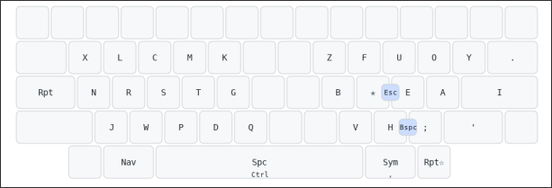
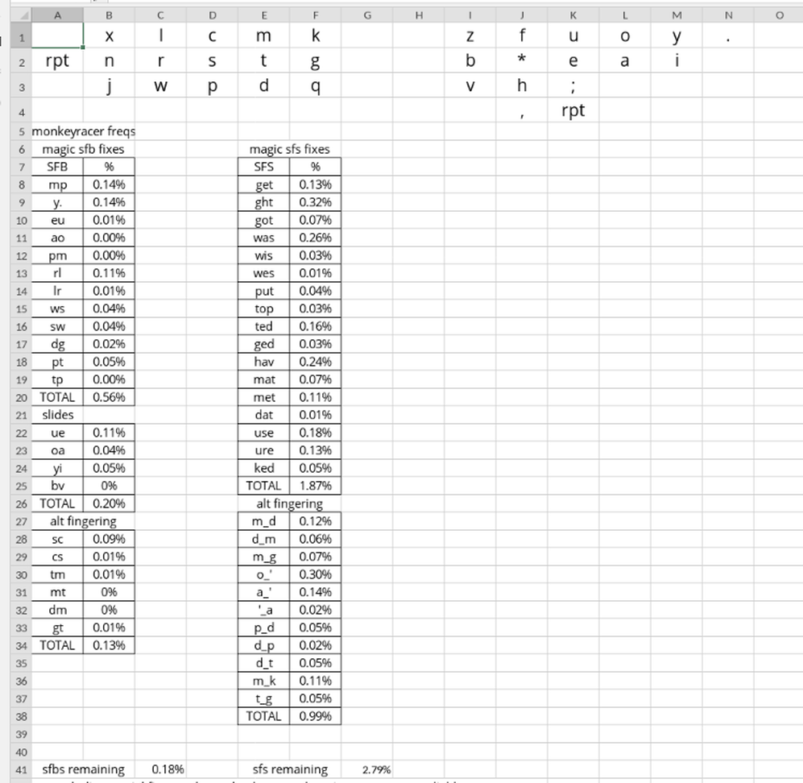

# Psilocybin

Designed for row stagger, with slides and magic key in mind.
The overview of all layers can be seen [here](assets/full_layout.png), and keymap-drawer can be accessed [here](https://caksoylar.github.io/keymap-drawer?keymap_yaml=H4sIAAAAAAAC_62U6XbSUBDHv_cpxlSNy7SUTVtcCwW7QBcWa0WsF7gYDtlMgj0cxI8-gx98BV-qT-KdCWs4PR6xH_Kbm8nMZO78c7MOrvB82YaO51gQGBLasiP6ZgBnpSPoyYEl3DVTDJx-kFkD-GL1LpWz6QivnQHD6DVjwva7sWSinxo_HgdDcffipFalXOn5lJsVviS7AXVdR_jHKzSNWf47hCJCDqGEcDQLhfcIBYQawgnChfJtTpPKbqACjhHKCBWEKsKbWV4WQbv-9VtDyCPsIhzMveoQ4RzhFGEP4WyW8hZhX62eqaWma5H2hmoEx-LrKFxV3BaCkYFc4JkT18Bil4aa8lBz1z9_cAWVtvqcYGlQVdEMvXlfNaHnTMeXcN61285VNO1QuMKW6vFBKU_3-44lydZcYt5uk9mT5sIrwrFWjG4nQN6gmp9JS6sdKZ_byPpui1ZF2Qm4lnNlky13Pxvs4IBGZPenXgAVzss57oA9wg_kTZvPCdfnojLoe7a-JMzAlerblaZqb3WR1JPbFEl_TqgThoQHhO_z0R8JDwkjQoPwkvApooS-QXhEeEG4JNydL7XOU7JYTSUV36k9k2UZFxrLEDTCa0KM8G2-2gfCfcIrwh39P06CUmSqTvRU9BcGXogzE8wkM8VMT_oqPGE-ZW4zd8LMrdCEFeKJvxyYqGw8Aa7KRXem095c4UiwVtw4980tby0dgMl1L-p4TOB98C6St_Wx36hDy7Gajh8KMXQzUE-kEJLbDYSeSlQDU6mmcmv0t9cao1lgOo6QTowD6ZhHIv8AxiQdPYoGAAA%3D)

## Magic rules 🪄

Magic rules effectively reduces bad patterns, such as SFBs and SFS to almost 0 percent. This also reduces keystrokes with word-builder rules, increasing efficiency.

⚝ is the `magic` key(home row right index)\
⬡ is the `right repeat` key(right thumb)\
⬢ is the `left repeat` key(left outer pinky)\
⎵ is white space

| Combo   | Output      |
| ------- | ----------- |
| m⚝      | mp          |
| y⚝      | y.          |
| e⚝      | eu          |
| a⚝      | ao          |
| p⚝      | pt          |
| p⬢      | pm          |
| r⚝      | rl          |
| l⚝      | lr          |
| w⚝      | ws          |
| s⚝      | sw          |
| n⚝      | nts         |
| i⚝      | ion         |
| ad⚝     | adm         |
| d⚝      | dg          |
| v⚝      | ver         |
| igh⚝    | ighbo       |
| t⚝      | tch         |
| t⬢      | tp          |
| ⎵⚝      | th          |
| ⎵⚝⎵     | the         |
| ⎵⚝⬡     | them        |
| ⎵⚝y⬡    | they'       |
| ⎵⚝y⬡r   | they're     |
| ⎵⚝y⬡v   | they've     |
| ⎵⚝y⬡l   | they'll     |
| ⎵⚝r⎵    | their       |
| ⎵⚝re⎵   | there       |
| ⎵⚝ro⎵   | through     |
| ⎵⚝n     | then        |
| ⎵⚝s     | these       |
| ⎵⚝o     | tho         |
| ⎵⚝os    | those       |
| ⎵⚝oh    | though      |
| scrip⚝  | script      |
| ip⚝     | ipment      |
| lop⚝    | lopment     |
| oop⚝    | oopment     |
| rt⚝     | rtment      |
| nt⚝     | ntment      |
| st⚝     | stment      |
| ft⚝     | ftment      |
| eat⚝    | eatment     |
| uit⚝    | uitment     |
| mit⚝    | mitment     |
| i⬡      | ing         |
| y⬡      | ying        |
| v⬡      | ving        |
| k⬢      | king        |
| ng⬡     | nging       |
| nd⬡     | nding       |
| ow⬡     | owing       |
| raw⬡    | rawing      |
| row⬡    | rowing      |
| ew⬡     | ewing       |
| g⚝      | ght         |
| g⬢      | get         |
| go⚝     | got         |
| wa⚝     | was         |
| wi⚝     | wis         |
| we⚝     | wes         |
| ke⚝     | ked         |
| h⬡      | hav         |
| j⚝      | just        |
| a⬡      | and         |
| pu⚝     | put         |
| to⚝     | top         |
| te⚝     | ted         |
| ge⚝     | ged         |
| ma⚝     | mat         |
| me⚝     | met         |
| da⚝     | dat         |
| stud⚝   | stud        |
| u⚝      | use         |
| u⬡      | ure         |
| f⬡      | for         |
| f⬡d     | found       |
| f⬡g⎵    | foreign     |
| f⬡go    | forgot      |
| f⬡ge    | forget      |
| f⬡n⎵    | forgotten   |
| f⬡w⎵    | follow      |
| f⬡r⎵    | forever     |
| f⬡rd    | forward     |
| ⎵⬡      | be          |
| ⎵⬡k     | back        |
| ⎵⬡c⎵    | because     |
| ⎵⬡co    | become      |
| ⎵⬡ca    | became      |
| ⎵⬡ci    | becoming    |
| ⎵⬡f⎵    | before      |
| ⎵⬡u⎵    | but         |
| ⎵⬡ut    | beauty      |
| ⎵⬡utf   | beautiful   |
| ⎵⬡utfy  | beautifully |
| ⎵⬡uty   | beautify    |
| ⎵⬡tn    | between     |
| ⎵⬡te    | better      |
| ⎵⬡tr    | betray      |
| ⎵⬡gi    | begin       |
| ⎵⬡ga    | began       |
| ⎵⬡gu    | begun       |
| ⎵⬢      | wh          |
| ⎵⬢⚝     | with        |
| ⎵⬢k     | work        |
| ⎵⬢⬡     | when        |
| ⎵⬢⬡v    | whenever    |
| ⎵⬢a     | what        |
| ⎵⬢av    | whatever    |
| ⎵⬢as⎵   | what's      |
| ⎵⬢asv   | whatsoever  |
| ⎵⬢i     | will        |
| ⎵⬢it    | without     |
| ⎵⬢l     | well        |
| ⎵⬢h     | while       |
| ⎵⬢c     | which       |
| ⎵⬢e     | where       |
| ⎵⬢u     | would       |
| ⎵⬢d     | world       |
| ⎵⬢t     | whether     |

## Fingering and slides

| Keys          | Fingering                          |
| ------------- | ---------------------------------- |
| sc/cs         | index-middle                       |
| tm/mt         | index-middle                       |
| gt/tg/t_g/g_t | index-middle                       |
| pd/p_d/d_p    | middle-index                       |
| dt            | index-middle                       |
| dm/m_d/d_m    | middle-index, middle on top        |
| m_k           | middle-index                       |
| m_g           | middle-index                       |
| o\_'          | ring-pinky                         |
| a\_'          | ring-pinky                         |
| bv            | slide                              |
| ⚝h            | slide                              |
| 'a/a'         | pinky-ring                         |
| ue            | slide                              |
| oa            | slide                              |
| yi            | slide,only works on wide mod fat i |
| i'            | pinky ring                         |

## Stats

